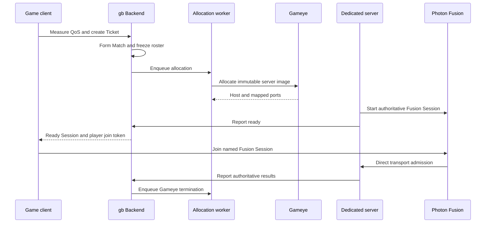

# gb game backend

`gb` is a game-backend CLI and runtime integration surface. This site contains the public installation and managed multiplayer integration contracts exported with each backend release.

## Install the CLI

```bash
curl -fsSL https://github.com/locus84/gb-cli-distributions/releases/latest/download/install.sh | sh
```

Verify the installation:

```bash
gb version
gb help
```

Native macOS and Linux binaries, Unity and TypeScript SDK packages, checksums, and the install script are published in the [public release repository](https://github.com/locus84/gb-cli-distributions/releases).

## Build a game project

1. [Create project context and separate operator/player authentication](project-setup.md).
2. Apply the [Game Data and LiveOps starter](game-data-liveops.md).
3. Integrate the [Unity SDK](unity-sdk.md) or [TypeScript SDK](typescript-sdk.md).
4. Add game-specific authoritative logic from the [Cloud Code cookbook](cloudcode-samples.md).
5. Add [managed multiplayer](managed-multiplayer.md) when the game needs allocated dedicated servers.

## Cloud Code cookbook

The public repository includes ten executable gameplay recipes with least-privilege manifests and assertion fixtures. Start with the local workflow, inspect queued operations, then adapt every client-supplied rule to authoritative game state before production use.

- [Cloud Code samples and workflow](cloudcode-samples.md)
- [Browse the downloadable cookbook](https://github.com/locus84/gb-cli-distributions/tree/main/samples/cloudcode-cookbook)

## Managed multiplayer at a glance



The Backend remains authoritative for Ticket ownership, Match roster, Session lifecycle, player admission credentials, and result settlement. Gameye allocates the process; Photon Fusion provides Session discovery and game transport.

## Start here

- [Project and authentication setup](project-setup.md)
- [Unity SDK quickstart](unity-sdk.md)
- [TypeScript SDK quickstart](typescript-sdk.md)
- [Game Data and LiveOps](game-data-liveops.md)
- [Cloud Code samples and workflow](cloudcode-samples.md)
- [Managed multiplayer architecture](managed-multiplayer.md)
- [Gameye + Photon Fusion integration](gameye-fusion.md)
- [Lifecycle and troubleshooting](lifecycle-troubleshooting.md)
- [Security boundaries](security.md)
